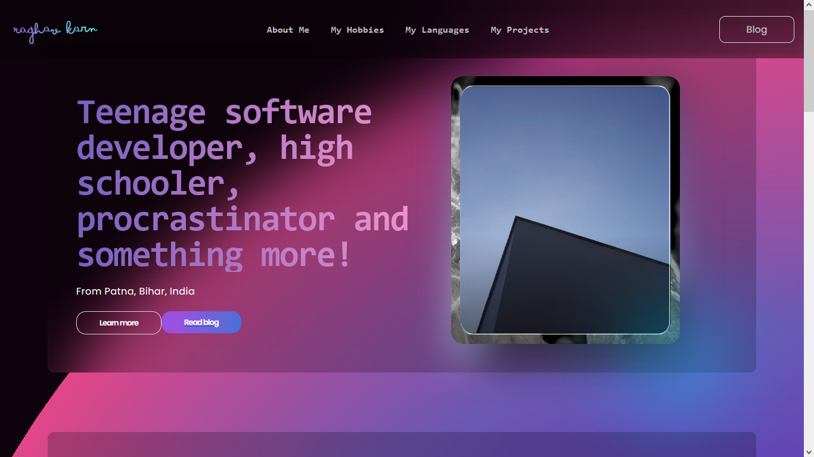
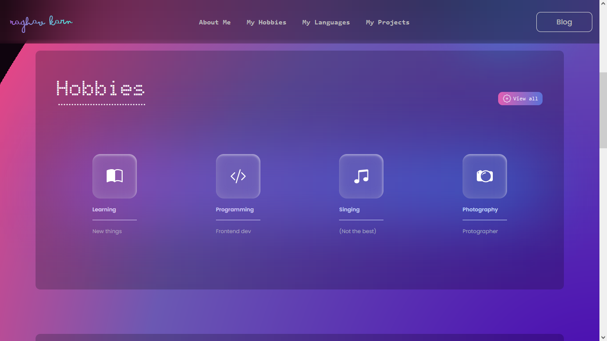

# `Portico 2` 🦈
Welcome to [**my portfolio**](https://raghav-karn.github.io/)!

**Note**: For the best experience, kindly view on desktop. Although it is mostly resposive, it is intended to be viewed on desktop.

**Desclaimer for waka heartbeats**: This project was tested in `.archive` folder (with `test.html`, `test.css` and `test.js` files) and most of the waka heartbeats should corresspond to those files. The code was then moved to `index.html`, `src/styles/style.css` and `src/scripts/script.js` and further improvised.

**Known bugs**: The 3D card on hero section does not load as intended, but transforms to what it should only after it's hovered over.

## Overview ✨
**Portico 2** is a follow-up to previous portfolio site ‒ [**Portico**](https://raghav-karn.github.io/portico). This site brings forward the beauty of blurs and gradients, a portfolio site enveloped in glassmorphic-design. It is a simple page with HTML, CSS (including Bootstrap icons) and vanilla JS.

## Images 📸

## How I managed to pull this off 📃
> A portfolio site to host my homepage (and my future domain), featuring elegant design and pretty much everything about me was something that I always needed. My previous portfolio site was cool but it didn't have enough room for everything, so I switched over to a regular portfolio style. 

Here is how I managed to do this:
- Wrote the basic frontends.
- Continued refining design by making out small errors and improvising.
- Added a 3D card in hero section from my previous project (Dimensions of Blåhaj).
- Added cool blur, gradients, as well as the 3D card and window dialog box popups for a stack of uniqueness. 

## The fun part — Learning! 😋
> Playing around, making small changes to refine and add the beautiful blur for a glassmorphic-design, using NOTHING-like Doto font, adding a fun 3D card and popups was a fun venture!

## The rough part — Animating the 3D model¡ 🎊
> Searching for SVGs outside of Bootstrap Studio, wandering into Google Fonts Icons but the icons as fonts could not be formatted in the way as preferred, so had to download 2 icons from there. Also, I couldn't figure out a hamburger menu for mobile version for now, so now hamburgers. ;-;

## Credits 🤝
**From online sources**: Bootstrap Icons, Google Fonts Icons, Google Fonts (Poppins, Doto), CDNFonts.com (Bimbo font)

**From previous projects**: Dimensions of Blåhaj, HOdrogen PerHOxide, Portico
---
